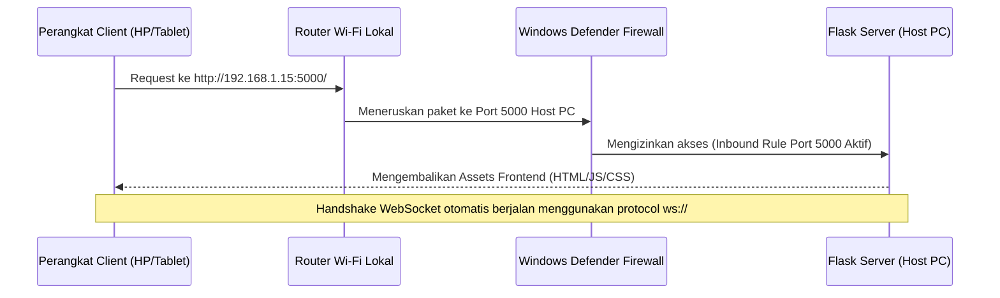

# Architectural Brief: Local Wi-Fi Sharing & Network Security Configuration
**Tanggal:** 2026-06-26  
**Dokumen:** `docs-log/2026-06-26-brief.md`

---

## 1. Cara yang Direkomendasikan (Recommended Approach)

Untuk membagikan dashboard portofolio ini ke perangkat lain dalam satu jaringan Wi-Fi lokal, direkomendasikan menggunakan **Protokol HTTP Biasa (Tanpa SSL)** dengan melakukan binding host Flask ke interface universal (`0.0.0.0`).

* **Kenapa HTTP?** Menghindari kompleksitas validasi sertifikat SSL pada perangkat mobile (iOS/Android) dan browser eksternal yang menuntut konfigurasi root CA terpercaya.
* **Binding Interface:** Mengubah `host='127.0.0.1'` menjadi `host='0.0.0.0'` di server agar Flask menerima request dari jaringan eksternal.

---

## 2. Benefit Singkat (Brief Benefits)

1. **Zero-Configuration Client:** Handphone, tablet, atau laptop lain dapat langsung membuka dashboard hanya dengan mengetik URL IP lokal (misal: `http://192.168.1.15:5000`) tanpa warning keamanan ("Your connection is not private").
2. **WebSocket Hot-Reload Natively Supported:** Protokol WebSocket otomatis menyesuaikan diri (`ws://` bukan `wss://`), menjaga fitur sync real-time saat file diubah.
3. **Cross-Device UI Testing:** Mempermudah visualisasi responsive layout (termasuk panel edit 25% yang baru) langsung di screen fisik handphone/tablet asli.

---

## 3. Hasil & Kenapa Cocok dengan Teknik Ini (Outcome & Rationale)

* **Hasil:** Dashboard dapat diakses secara lancar oleh perangkat apa pun di jaringan Wi-Fi yang sama dengan latensi sangat rendah.
* **Rasional:** Aplikasi ini didesain sebagai alat penunjang produktivitas lokal (local workspace utility). Penggunaan HTTP memangkas overhead pemeliharaan sertifikat SSL yang dinamis (karena IP Address local komputer hosting sering berubah tergantung DHCP router Wi-Fi).

---

## 4. Update File Requirement (Dependencies Changes)

* **Python (`backend/requirements.txt`):** 
  * **Tidak ada library tambahan yang wajib di-add.** Flask dan Werkzeug bawaan secara default sudah mendukung binding ke `0.0.0.0` lewat parameter `host='0.0.0.0'` di `app.run()`.
* **Frontend (`frontend/package.json`):**
  * **Tidak memerlukan package baru.** Deteksi WebSocket di `App.tsx` sudah dinamis mengikuti protokol asal (`window.location.protocol` mendeteksi `http:` -> `ws:` atau `https:` -> `wss:`).

---

## 5. Alur Teknik (Technical Flow)

---

## 6. Kesimpulan & Potensi Fitur Cabang (Conclusion & Branching Features)

### Kesimpulan
Teknik HTTP Bind `0.0.0.0` adalah pilihan arsitektur terbaik untuk kemudahan kolaborasi dan testing lokal tanpa friksi SSL. Keamanan dilindungi oleh boundary jaringan Wi-Fi pribadi Anda.

### Potensi Fitur Cabang (Future Enhancements)
1. **Read-Only Mode for Guest Devices:**
   * Deteksi jika request datang bukan dari `localhost` (IP lokal eksternal), maka sembunyikan tombol **Create**, **Edit**, dan **Delete** untuk melindungi berkas Markdown Anda dari modifikasi tidak sah oleh orang lain di jaringan Wi-Fi yang sama.
2. **Basic Token Auth / PIN Access:**
   * Menambahkan form login pin/sederhana (disimpan di `.env`) sebelum mengizinkan modifikasi data dari IP eksternal.
3. **IP Auto-Discovery Alert:**
   * Menampilkan popup/console info di terminal host yang memberi tahu IP lokal terkini beserta link yang siap di-scan (dalam bentuk QR Code) untuk memudahkan perangkat lain terhubung.
