# Two-Sided Connection Network

The **Two-Sided Connection Network** (colloquially known as the *"double-side fork thing"*) is an interactive, visual relationship map rendered within the detailed view panel of any selected portfolio entry. 

It provides an intuitive graphical visualization of dependencies and dependents using custom SVG rendering, bezier curves, state-based color coding, and flow animations.

```mermaid
graph LR
    Dep1[Dependency A] --- W1((Wire))
    Dep2[Dependency B] --- W2((Wire))
    W1 --> Active[Selected Entry]
    W2 --> Active
    Active --> W3((Wire))
    Active --> W4((Wire))
    W3 --- Depd1[Dependent X]
    W4 --- Depd2[Dependent Y]
    
    style Active fill:#1e293b,stroke:#e2e8f0,stroke-width:2px
    classDef default fill:#0f172a,stroke:#334155,stroke-width:1px;
```

---

## 📐 Layout Architecture

The network acts as a double-sided branching structure centered around the selected card:

1. **Left Column (Dependencies / Prerequisites)**: 
   * Displays the entries that the currently selected item depends on (defined under the `dependencies` list in the item's YAML frontmatter).
   * Connection wires flow from left-to-right, terminating at the center node.
2. **Center Node (Selected Entry)**:
   * Displays the currently open entry's title with a distinct glowing indicator in the exact center of the panel.
3. **Right Column (Dependents / Successors)**:
   * Displays other entries in your workspace that depend on the currently selected item (i.e. entries whose frontmatter `dependencies` include the current entry's ID).
   * Connection wires flow from the center node out to the right.

---

## ⚡ Interactivity & Navigation

The network graph is not static; it serves as a central navigation hub:

* **Click to Navigate**: Clicking on any left (dependency) or right (dependent) node immediately updates the details modal/panel to focus on that selected item. This allows users to traverse complex prerequisite chains seamlessly (e.g. following a workstation component ➔ to a certification ➔ to a completed project).
* **Hover Highlighting**: Hovering over any node dynamically highlights its corresponding connection wire by increasing its stroke width (from `1.2px` to `2.5px`) and its opacity (from `0.45` to `1.0`), providing instant visual tracking of relationships.
* **Auto-Scaling Height**: To prevent overlapping when an entry has many dependencies or dependents, the SVG viewport's height dynamically scales based on the number of nodes:
  $$\text{Height} = \max(\text{Dependencies}, \text{Dependents}, 1) \times 36\text{px} + 40\text{px}$$

---

## 🎨 Color-Coding System & States

The network nodes and wires are dynamically color-coded to reflect real-time status and chronological bounds:

| Entry Type | State / Conditions | Color | Hex Code | Visual Meaning |
|---|---|---|---|---|
| **Project (`proj`)** | Done / Completed | Slate Grey | `#475569` | Finished, archived project |
| | Blocked (Unfinished dependencies) | Slate Grey | `#475569` | Cannot start; prerequisites pending |
| | Unblocked & Ready | Emerald Green | `#10b981` | Open for work; all dependencies complete |
| **Achievement (`achv`)** | Locked (Unfinished dependencies) | Light Slate | `#94a3b8` | Prerequisite achievements pending |
| | Completed / Unlocked | Gold | `#fbbf24` | Achievement unlocked |
| **Item (`item`) / Cert (`cert`)** | Completed & Within Date Range | Purple | `#8154c0` | Currently active completed hardware/credential |
| | Pending & Within Date Range | Purple | `#8154c0` | Currently active ongoing hardware/credential |
| | Completed & Past Date Range | Blue | `#3b82f6` | Completed archived credential/hardware |
| | Uncompleted & Past Date Range | Red | `#ef4444` | Expired, lapsed, or missed milestone |

---

## 🌀 Pathway Flow Animation

For **Items** and **Certifications** that are:
1. **Not yet completed** (`done` is false)
2. **Currently active** (the current date falls between `datestart` and `dateend`)

The connection wires apply the `.animate-pathway-flow` class. This renders a dashed flowing animation along the curved bezier path, representing a live "flow" of energy/dependencies feeding into the active project.
