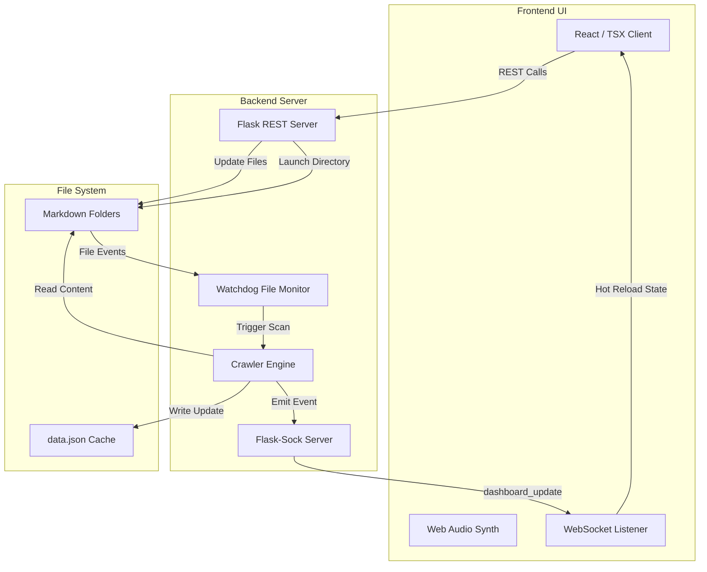

# System Architecture

The Workspace Portfolio Indexer is structured as a decoupled client-server application optimized for local development and real-time execution.



---

## 💻 Frontend Client

The frontend is a Single-Page Application (SPA) built using **React, TypeScript, Tailwind CSS, and Vite**.

* **Dashboard HUD**: Displays operational metrics and filters, capturing standard keyboard hotkeys (`Q`, `W`, `E`, `R`, `Space`) to execute queries and update application state.
* **Chronological Timeline**: Renders card configurations based on chronological metadata, supporting layout wrapping and markdown visualization.
* **Audio Synthesis Interface**: Utilises the browser's native **Web Audio API** to generate pitch-randomised audio pulses (UI ticks and chimes) dynamically without loading static external audio files.

---

## 🐍 Backend Server

The backend is built in **Python** using the **Flask** framework, running a lightweight and robust local execution environment.

* **File Crawling Engine (`scan.py`)**: Traverses subdirectories of the watch directory, extracts markdown content, parses YAML headers, and stores records in `data.json`.
* **Real-time Observer**: Integrates the `watchdog` library to asynchronously detect file creation, modification, or deletion.
* **Host Integrations**: Exposes specific system controls (such as triggering the default OS file explorer to reveal files).
* **TLS Certificate Generator (`generate_certs.py`)**: Automatically creates self-signed SSL/TLS certificates on boot to serve the frontend/backend over secure HTTPS and WSS connections, maintaining permission contexts for advanced Web APIs (e.g. Web Audio).

---

## 🔄 Real-Time Sync Pipeline

```
[Local File Change] ➔ [Watchdog Alert] ➔ [Debounce Wait (2s)] ➔ [Re-scan Directory] ➔ [Update data.json] ➔ [WebSocket Broadcast] ➔ [React Reload]
```

1. **Detection**: The `watchdog` thread triggers on directory change.
2. **Debounce**: A thread-safe debouncer pauses execution (default: 2 seconds) to allow file operations to fully write, preventing redundant scans.
3. **Execution**: The scanning crawler compiles markdown metadata and updates the cache.
4. **Broadcast**: An event payload is broadcast via a persistent WebSocket path to all connected clients.
5. **Re-rendering**: The client processes the state payload and performs an in-memory DOM refresh.

---

## 🔒 Security Boundaries

To guarantee security in a local environment:
* **Directory Isolation**: All file-opening commands inspect targets against the absolute watched path. Any requests targeting paths outside this container return an `Access Denied (403)` error, blocking path-traversal attacks.
* **Sanitization**: Folder and category inputs are sanitized via regular expressions to allow only alphanumeric characters, dashes, and underscores.
